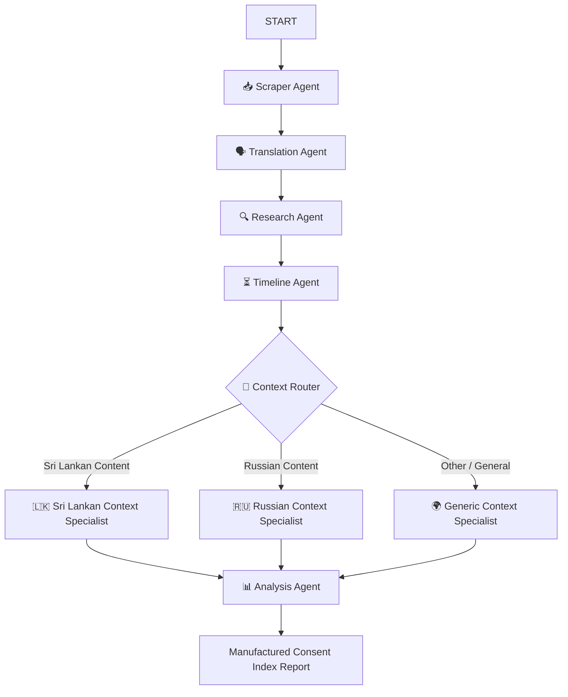

# 🕵️‍♂️ Ambient Manufactured Consent Detector

An advanced multi-agent pipeline built with **Google ADK 2.0 (Agent Development Kit)** designed to detect manufactured consent, state-backed propaganda, and foreign NGO influence in media articles, blogs, and YouTube video transcripts.

The pipeline utilizes a graph-based **Workflow** architecture to dynamically route articles to specialized geopolitical context analysts depending on the target region or language of the text.

---

## 🏗️ Project Structure

```
.
├── app/                           # Core agent logic and dashboard
│   ├── agent.py                   # Multi-agent Workflow graph definition
│   ├── tools.py                   # Custom tools (e.g. YouTube transcript extraction, scraping)
│   ├── streamlit_app.py           # Streamlit Web UI dashboard
│   ├── fast_api_app.py            # FastAPI production backend server
│   └── app_utils/                 # App telemetry, adapters, and typing helpers
├── tests/                         # Unit, integration, and evaluation suites
│   ├── eval/                      # Evaluation configurations and metrics
│   │   ├── datasets/              # Dataset of test cases (consent-dataset.json)
│   │   └── metrics.py             # LLM-as-judge scoring rubric
│   └── eval_runner.py             # CLI runner for the evaluation dataset
├── docs/                          # Architectural Decision Records (ADRs)
├── Makefile                       # Unified shortcuts for local development
├── pyproject.toml                 # UV dependency management configuration
└── README.md                      # This document
```

---

## 🛠️ Requirements & Setup

Before running the project, make sure you have:
1. **uv**: Python package manager - [Install Guide](https://docs.astral.sh/uv/getting-started/installation/)
2. **agents-cli**: Google Agents CLI - Install with:
   ```bash
   uv tool install google-agents-cli
   ```
3. **Gemini API Key**: Set your key in a `.env` file at the root of the project:
   ```env
   GEMINI_API_KEY=your-api-key-here
   ```

---

## 🚀 Quick Start / Development Commands

We provide a `Makefile` with standard workflows for local setup, execution, testing, and linting:

| Command | Purpose |
|---------|---------|
| `make install` | Create virtual environment (`.venv`) and install all package dependencies via `uv sync` |
| `make run` | Launch the Streamlit dashboard on `http://localhost:8501` |
| `make eval` | Run the local multi-agent evaluation suite using LLM-as-judge grading |
| `make playground` | Launch the interactive local ADK CLI agent playground |
| `make lint` | Check code quality using Ruff |
| `make clean` | Remove `.venv`, `__pycache__`, and temp caches |

---

## 🧠 Workflow Architecture & Agent Pipeline

The detector operates on a graph-based **Workflow** containing the following nodes:



### 1. Ingestion & Processing
*   **Scraper Agent**: Automatically extracts article text or extracts transcripts directly from YouTube URLs.
*   **Translation Agent**: Preserves original framing, metaphors, and tone while translating non-English content to English.
*   **Research Agent**: Identifies entities (think tanks, politicians, NGOs) and runs real-time **Google Search grounding** (optimized to exactly one query) to unearth backing and funding history.
*   **Timeline Agent**: Investigates preceding narrative timelines and media/social-media campaign coordination (runs exactly one optimized query).

### 2. Geopolitical Routing & Context Specialists
*   **Context Router**: A classification node that uses the base model to direct the article to the appropriate context specialist based on the text, research brief, and media timeline.
*   **Sri Lankan Context Specialist**: Focuses on domestic Sri Lankan political histories, election dynamics, local partisan groups, and NGO networks.
*   **Russian Context Specialist**: Highlights Kremlin foreign policy, state-backed media networks (RT, Sputnik), and proxy/information-warfare techniques.
*   **Generic Context Specialist**: Handles general international media topics.

### 3. Synthesis & Attributions
*   **Analysis Agent**: Integrates findings, computes sub-scores, lists detected actors and propaganda techniques, and outputs the final **Manufactured Consent Index (MCI)** report.

---

## 📊 Evaluation & Verification

The evaluation suite tests the workflow across 5 different scenarios covering organic local news, state propaganda, foreign NGO policy pushes, generic US debates, and Sri Lankan provincial updates.

To execute the verification suite:
```bash
make eval
```

It runs inferences with a 300-second timeout, grades results via the local LLM-as-judge rubric, and displays a summary verdict scorecard.
